## 🏗️ Architecture

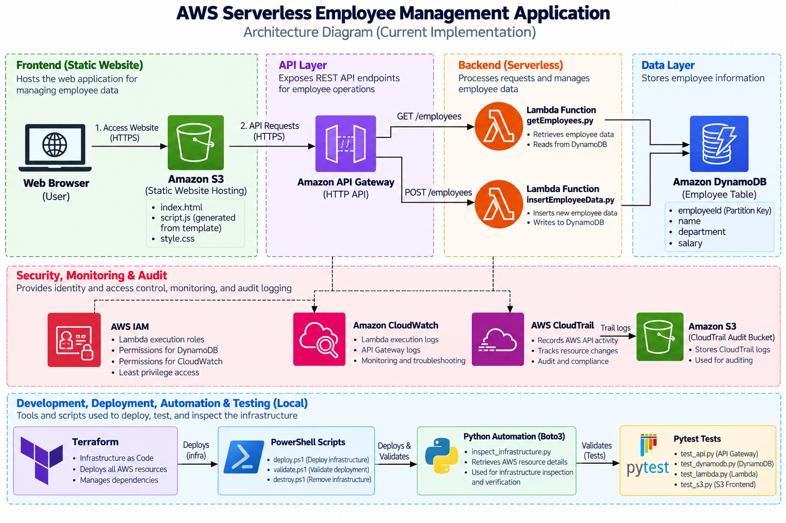

[🔗 View Architecture Image](screenshots/01-architecture.png)

### V1 Architecture

The deployed V1 architecture consists of:

- **Amazon S3** — Static frontend hosting
- **Amazon API Gateway** — HTTP API endpoints
- **AWS Lambda** — Serverless backend processing
- **Amazon DynamoDB** — Employee data storage
- **AWS IAM** — Lambda execution permissions
- **Amazon CloudWatch** — Lambda logs and operational inspection
- **AWS CloudTrail** — AWS API activity auditing
- **Amazon S3** — CloudTrail audit log storage
- **Terraform** — Infrastructure provisioning and management
- **Python/Boto3** — AWS infrastructure inspection and automation

The frontend is intentionally hosted using a **public S3 configuration in V1**.

### V2 Security Architecture

Planned improvements include:

- **CloudFront**
- **Origin Access Control (OAC)**
- **AWS WAF**
- **Private S3 frontend**

> CloudFront and WAF are not part of the currently deployed V1 infrastructure.

---

## ☁️ AWS Services Used

- **Amazon S3** — Static frontend hosting and CloudTrail audit log storage
- **Amazon API Gateway** — HTTP API endpoints
- **AWS Lambda** — Serverless backend processing
- **Amazon DynamoDB** — Employee data storage
- **AWS IAM** — Lambda execution roles and permissions
- **Amazon CloudWatch** — Lambda logs and operational inspection
- **AWS CloudTrail** — AWS API activity auditing

---

## 💻 Application Layer

### Frontend

- HTML
- CSS
- JavaScript
- Amazon S3 Static Website Hosting

### Backend

- Python
- AWS Lambda
- API Gateway HTTP API
- Amazon DynamoDB

### API Endpoints

- `GET /employees` — Retrieve employee records
- `POST /employees` — Insert employee data

---

## 🏗️ Infrastructure as Code

The AWS infrastructure is provisioned and managed using **Terraform**.

### Terraform Responsibilities

- AWS provider and region configuration
- S3 buckets and frontend hosting
- API Gateway HTTP API
- Lambda functions
- DynamoDB table
- IAM roles and policies
- CloudWatch log groups
- CloudTrail and audit S3 bucket
- Frontend object deployment
- Infrastructure lifecycle management

### Terraform Workflow

```text
terraform fmt
      ↓
terraform validate
      ↓
terraform plan
      ↓
terraform apply
```
---

## 🤖 Python & Boto3 Automation

Python and Boto3 are used to inspect AWS infrastructure and retrieve operational information directly through AWS APIs.

### Boto3 Inspection Areas

- AWS Lambda functions
- DynamoDB tables and items
- S3 buckets and objects
- API Gateway APIs, routes, and stages
- CloudWatch log groups, streams, and events
- CloudTrail trails and events
- IAM roles and inline policies

### Automation Features

- AWS API pagination
- AWS-specific error handling with `ClientError`
- Resource filtering
- Structured AWS API response inspection

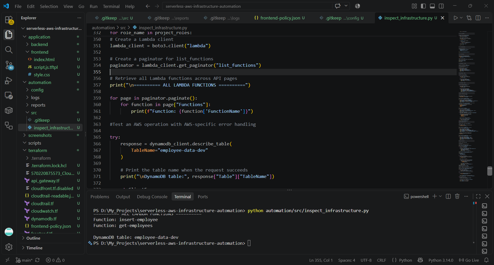

---

## 🧪 Infrastructure Validation

The project includes automated validation using **pytest** to verify key AWS components.

### Test Coverage

- API Gateway
- DynamoDB
- AWS Lambda
- Amazon S3

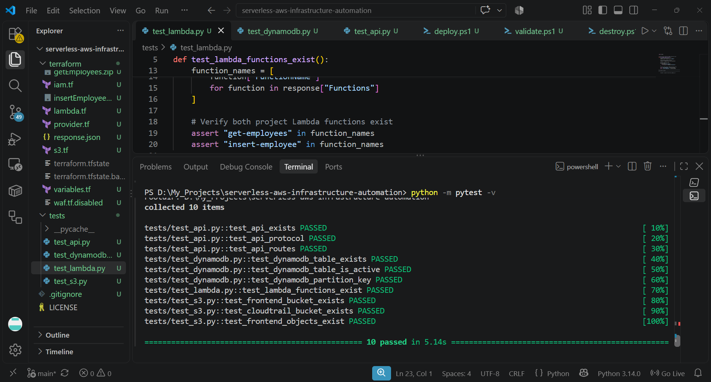

---

## 🔧 Troubleshooting Experience

- **DynamoDB AccessDeniedException** — Investigated Lambda IAM permissions and identified a DynamoDB table-name mismatch between Terraform and the Lambda configuration.
- **CloudFront account verification** — Investigated AWS account verification requirements and deferred CloudFront from V1.
- **S3 public access configuration** — Configured the V1 frontend bucket for intentional public access.
- **CloudTrail `.gz` logs** — Used Python to decompress CloudTrail log files on Windows.
- **Terraform redeployment** — Recreated infrastructure and validated resources after destroy/redeploy cycles.

---

## 🚀 Deployment Automation

The project includes PowerShell scripts to simplify and control the Terraform workflow.

- `validate.ps1` — Formats and validates Terraform configuration
- `deploy.ps1` — Runs validation, plan, confirmation, and Terraform apply
- `destroy.ps1` — Provides a controlled infrastructure destruction workflow with confirmation steps

---

## 🔐 Security & IAM

- IAM roles are used as Lambda execution roles.
- Lambda permissions are scoped to the required DynamoDB actions.
- CloudWatch provides Lambda execution logs for troubleshooting.
- CloudTrail records AWS API activity for auditing.
- The V1 frontend uses intentional public S3 access.
- V2 plans to use CloudFront, OAC, and WAF for improved frontend security.

---

## 📁 Repository Structure

```text
serverless-aws-infrastructure-automation/
│
├── application/
│   ├── backend/
│   │   ├── getEmployees.py
│   │   └── insertEmployeeData.py
│   │
│   └── frontend/
│       ├── index.html
│       ├── script.js.tftpl
│       └── style.css
│
├── automation/
│   ├── config/
│   ├── logs/
│   ├── reports/
│   └── src/
│       └── inspect_infrastructure.py
│
├── scripts/
│   ├── deploy.ps1
│   ├── destroy.ps1
│   └── validate.ps1
│
├── screenshots/
│
├── terraform/
│   ├── api_gateway.tf
│   ├── cloudtrail.tf
│   ├── cloudwatch.tf
│   ├── dynamodb.tf
│   ├── frontend.tf
│   ├── iam.tf
│   ├── lambda.tf
│   ├── provider.tf
│   ├── s3.tf
│   └── variables.tf
│
├── tests/
│   ├── test_api.py
│   ├── test_dynamodb.py
│   ├── test_lambda.py
│   └── test_s3.py
│
├── docs/
│   └── AWS-Troubleshooting-Case-Study.pdf
│
├── .gitignore
└── LICENSE
```
---

## 🚀 Quick Start

```powershell
# Move to the project root
cd serverless-aws-infrastructure-automation

# Validate the Terraform configuration
.\scripts\validate.ps1

# Deploy the AWS infrastructure
.\scripts\deploy.ps1
```
---
## 📸 Project Screenshots

### 01. AWS Serverless Architecture


### 02. Terraform Project Structure
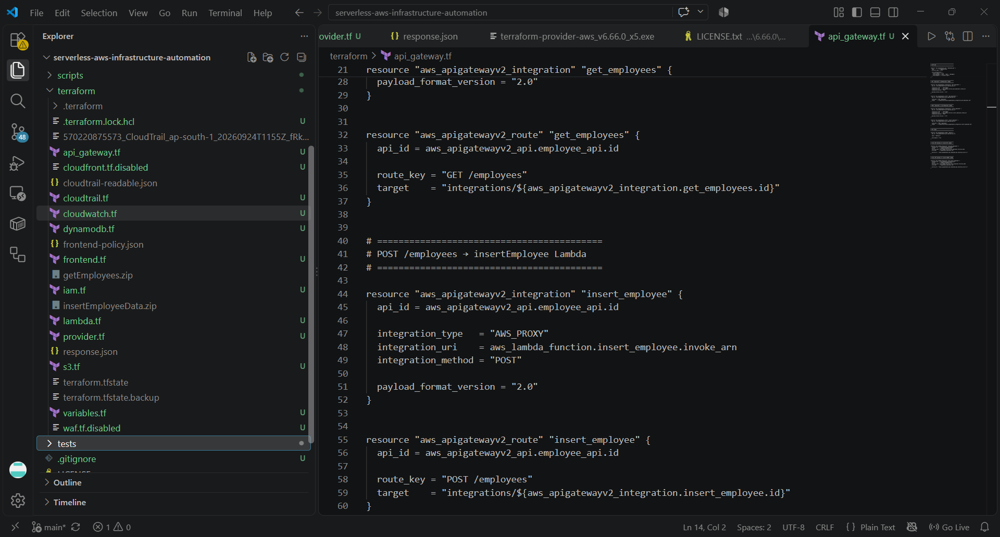

### 03. Terraform Plan
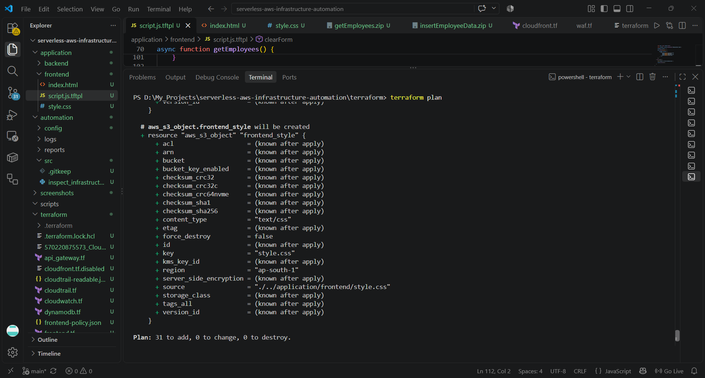

### 04. Terraform Apply
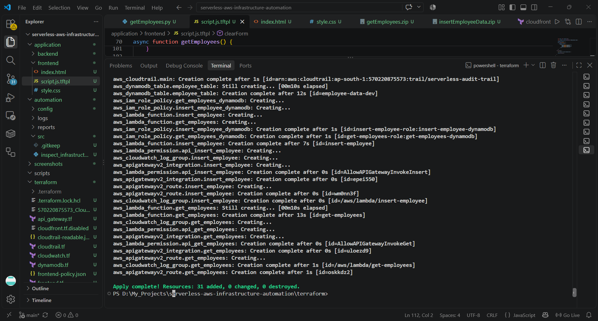

### 05. AWS Deployment
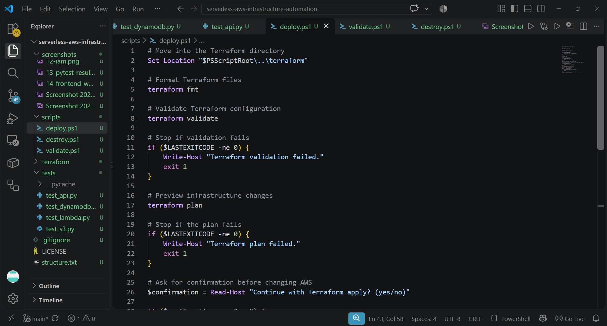

### 06. Terraform Validation
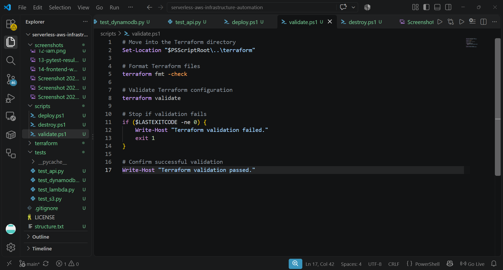

### 07. Lambda & Boto3 Inspection


### 08. DynamoDB & Boto3 Inspection
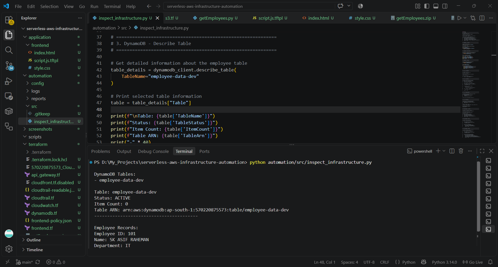

### 09. S3 & Boto3 Inspection
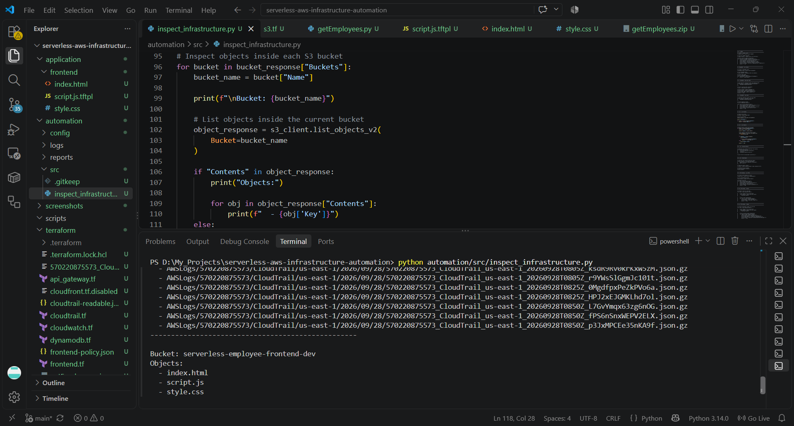

### 10. API Gateway Configuration
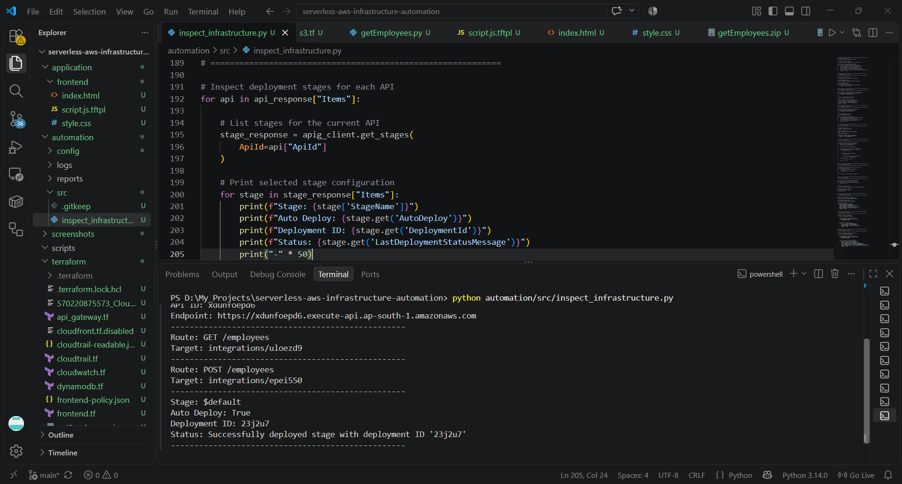

### 11. CloudWatch Lambda Logs
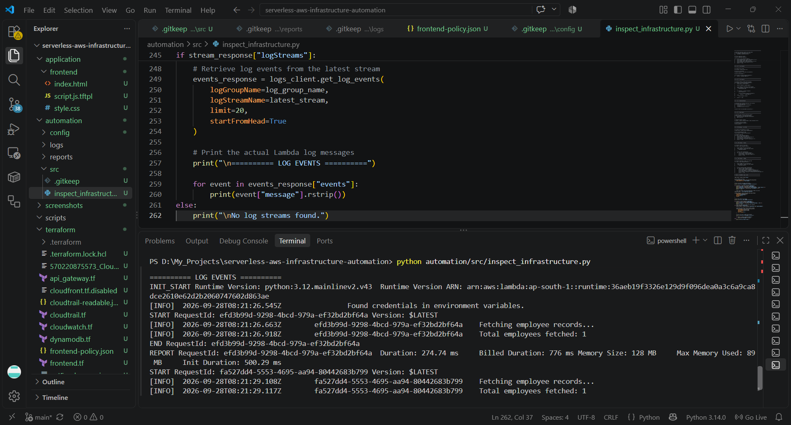

### 12. CloudTrail Configuration & Events
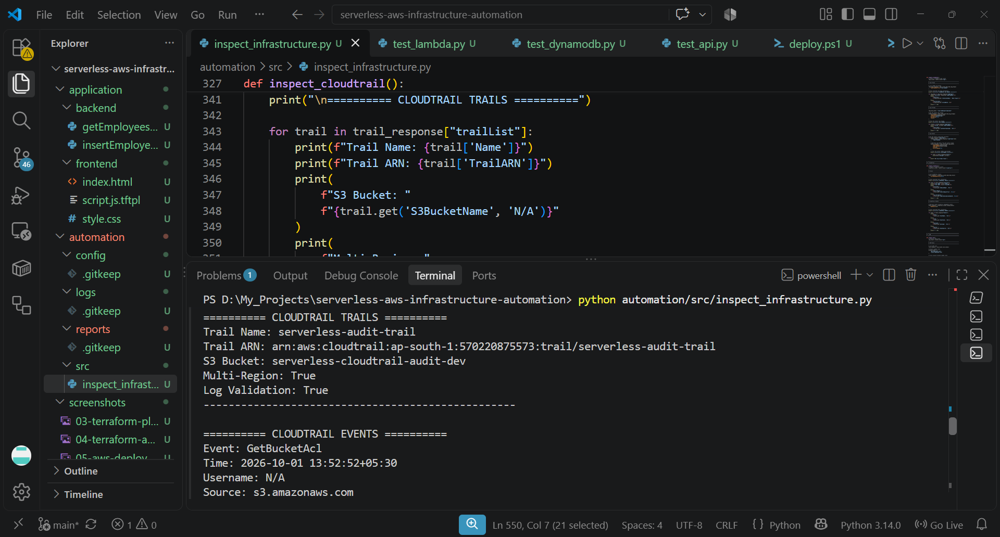

### 13. IAM Roles & Policies
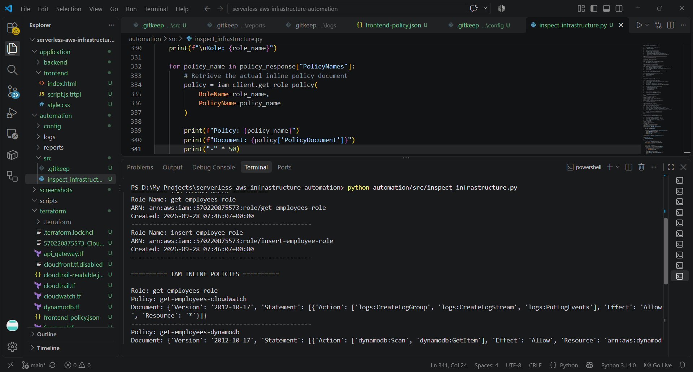

### 14. Pytest Infrastructure Validation


### 15. Working Frontend Application
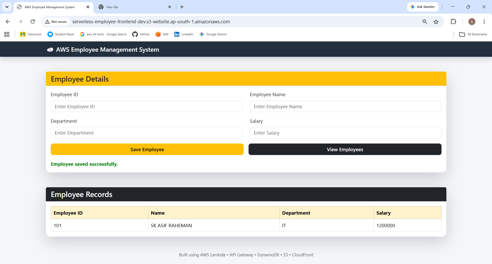
---

## 📌 Key Engineering Concepts

- Infrastructure as Code with Terraform
- Serverless AWS architecture
- IAM roles and permissions
- API Gateway to Lambda integration
- Lambda to DynamoDB integration
- AWS CloudWatch logging
- AWS CloudTrail auditing
- Python/Boto3 infrastructure inspection
- AWS API pagination
- AWS-specific error handling
- Infrastructure validation with pytest
- Terraform deployment automation

---

## 📚 Lessons Learned

- Infrastructure configuration must remain consistent across Terraform, Lambda, and AWS resources.
- IAM permissions should be checked when troubleshooting AWS `AccessDenied` errors.
- AWS API responses should be inspected before extracting required fields with Boto3.
- Pagination is important when working with AWS APIs that return multiple pages of resources.
- CloudWatch logs are useful for diagnosing Lambda execution issues.
- Terraform validation and planning should be performed before applying infrastructure changes.
- Infrastructure destruction should use controlled confirmation steps to avoid accidental resource deletion.

---

## 🔮 Future Improvements

- CloudFront with Origin Access Control (OAC)
- AWS WAF integration
- Private S3 frontend
- GitHub Actions CI/CD
- AWS IAM OIDC integration for GitHub Actions
- Remote Terraform backend
- Extended infrastructure validation and automation

---

## 👤 Author

**SK ASIF RAHEMAN**

MCA Graduate | AWS Cloud & Infrastructure

📍 Bhubaneswar, Odisha

- [GitHub](https://github.com/asifraheman2002)
- [LinkedIn](https://linkedin.com/in/sk-asif-raheman)

---